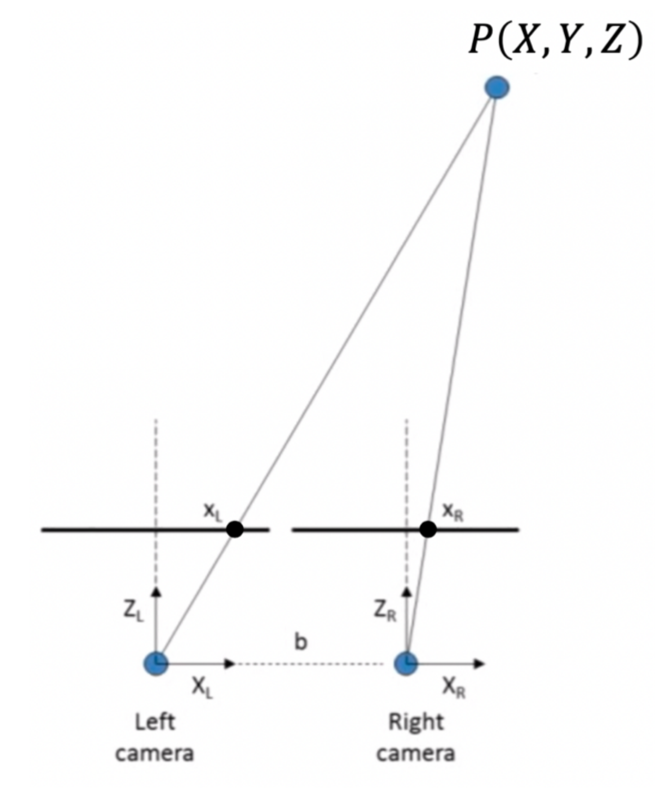

# CS181 Midterm Practice Problems

## Lecture 1

1\. What is the focal length? Give a brief definition.

The focal Length is the distance from the
center of a lens to the focal point.
The focal point is where light
converges to form an image.

2\. A video camera sends 30 images (frames) per second of $640 \times 480$  
“true color” pixel values. How many bytes per second are sent?

$$
\begin{align*}
    640 \times 480 &= 307,200 \text{ pixels} \\
    1 \text{ pixel} &= 8 \text{ bits} = 1 \text{ byte} \\
    307,200 \times 1 \times 30 &= 9,216,000 \text{ bytes/second} 
\end{align*}
$$

## Lecture 2

3\. True or False: The two projection matrices P1 and P2, below, 
will map a real world point to the same point 
in the image plane (assume $f$ does not equal 0).

$$
    P_1 = \begin{bmatrix}
            1 & 0 & 0 & 0 \\
            0 & 1 & 0 & 0 \\
            0 & 0 & 1/f & 0
            \end{bmatrix},
    P_2 = \begin{bmatrix}
            f & 0 & 0 & 0 \\
            0 & f & 0 & 0 \\
            0 & 0 & 1 & 0
            \end{bmatrix}
$$

$$
\begin{align*}
    \begin{bmatrix}
        1 & 0 & 0 & 0 \\
        0 & 1 & 0 & 0 \\
        0 & 0 & 1/f & 0
    \end{bmatrix}
    \begin{bmatrix}
        a \\
        b \\
        c
    \end{bmatrix}
    &= \begin{bmatrix}
        a \\
        b \\
        c/f
    \end{bmatrix}
    = \begin{bmatrix}
        af/c \\
        bf/c \\
        1
    \end{bmatrix} \\
%
    \begin{bmatrix}
        f & 0 & 0 & 0 \\
        0 & f & 0 & 0 \\
        0 & 0 & 1 & 0
    \end{bmatrix}
    \begin{bmatrix}
        a \\
        b \\
        c
    \end{bmatrix}
    &= \begin{bmatrix}
        fa \\
        fb \\
        c
    \end{bmatrix}
    = \begin{bmatrix}
        af/c \\
        bf/c \\
        1
    \end{bmatrix}
\end{align*}
$$

True, the projections are equivalent. 

## Lecture 3

4\. Which of the following factors does not affect the intrinsic parameters of a camera model?

A. Focal length \
B. Image resolution \
C. Principal point \
D. None of the above

None of the above. The intrinsic parameters of a camera 
characterize the optical, geometric, and digital
characteristics of a camera.

These account for
1. Focal Length
2. Principal point (where optical axis intersects image plane)
3. Pixel Aspect ratio (pixel shape)
4. Angle between axes (skewness of sensor)

The Image Resolution can affect the pixel aspect ratio and pixel size.

5\. Write down a matrix that will translate a homogeneous point $[x, y, 1]^T$ 3 units in the positive x
direction and 10 units in the positive y direction.

$$
\begin{align*}
\begin{bmatrix}
    x + 3 \\
    y + 10 \\
    1
\end{bmatrix}
&= 
\begin{bmatrix}
    1 & 0 & 3 \\
    0 & 1 & 10 \\
    0 & 0 & 1
\end{bmatrix}
\begin{bmatrix}
    x \\
    y \\
    1
\end{bmatrix}
\end{align*}
$$

6\. Consider two identical cameras (such that $K=K'$), 
whose optical axis coincides with the z axis, 
whose focal length is 0.03 meters, with square pixels, 
no pinhole point offset and zero skew. \
What is its intrinsic camera matrix, $K$?

$$
\begin{align*}
    \mathbf{K} &=
    \begin{bmatrix}
        -f  & s         & c_x \\
        0   & -\alpha f & c_y \\
        0   & 0         & 1
    \end{bmatrix}
\end{align*}
$$
where $\alpha$ is the aspect ratio,\
$s$ is the skew and\
$(c_x, c_y)$ is the principal point.

$$
\begin{align*}
    f &= 0.03 \\
    \mathbf{K} &=
    \begin{bmatrix}
        -0.03  & 0     & 0 \\
        0   & 0.03 & 0 \\
        0   & 0         & 1
    \end{bmatrix}
\end{align*}
$$

The optical axis coinciding with the
z-axis means it intersects with the
projection plane at the origin. (Imagine right hand rule as axes.)

## Lecture 4

7\. What does a homography do? And mention some of its properties.

A homography is a projective transformation that
maps points to points. This determines the relationship
between two images from the same camera center.

Properties of homographies:
1. The origin does not necessarily map to the origin (pan left to right).
2. Lines map to lines.
3. Parallel lines do not necessarliy remain parallel.
4. Ratios are not preserved.

8\. How many point correspondences are needed to fit a 2D affine model?

A 2d affine transformation has 6 degrees of freedom,
so at least 3 correspondences are required (each gives 2).

9\. Select all the options that are correct 
regarding properties of homographies (2D projective transformations): \

A. Origin does not necessarily map to origin \
B. Every measurement (i.e., point) provides 1 independent equation \
C. parallel lines remain parallel \
D. Ratios are not preserved 

A: True \
B: False: Each provides 2 equations. \
C: False: Parallel lines may not remain parallel. \
D: True: Ratios are not necessarily preserved.

## Lecture 5

10\. In the image below, let $P(X, Y, Z) = (14, 0, 24)$, 
$X_L = 5$, $X_R = 11$, and $f = 4$
(assume each measurement has the same unit). \
Calculate the disparity between the projection of $P$ onto the
left and right camera image planes.

$$
\begin{align*}
    x_L &= f \frac{X - X_L}{Z} \\
    x_R &= f \frac{X - X_R}{Z} \\
    \text{disp} &= x_R - x_L \\
    &= \frac{f}{Z} 
    \left( \left(X - X_R \right) - \left(X - X_L \right) \right) \\
    &= \frac{f}{Z} \left( X_L - X_R  \right) \\
    &= \frac{4}{24} \left( 5 - 11  \right) \\
    &= -1
\end{align*}
$$

## Lecture 6

11\. What is an epipolar line and what is its purpose in epipolar geometry?

An epipolar line is the line that appears
on image_2 that corresponds with potential
points that project onto image_1 as point p.

In epipolar geometry, this reduces the
search space for a corresponding point to
points on the line.

12\. Given that there is a fundamental matrix

$$
    F = \begin{bmatrix}
        1 & 2 & 3 \\
        4 & 5 & 6 \\
        7 & 8 & 9
    \end{bmatrix}
$$
and a point 
$$
    x = \begin{bmatrix}
        2 \\
        4 \\
        6
    \end{bmatrix}
$$
What is the corresponding epipolar line $l'$ on the second image?

$$
\begin{align*}
    l' &= Fx \\
    &= \begin{bmatrix}
        1 & 2 & 3 \\
        4 & 5 & 6 \\
        7 & 8 & 9
    \end{bmatrix}
    \begin{bmatrix}
        2 \\
        4 \\
        6
    \end{bmatrix} \\
    &= \begin{bmatrix}
        1 * 2 + 2 * 4 + 3 * 6 \\
        4 * 2 + 5 * 4 + 6 * 6 \\
        7 * 2 + 8 * 4 + 9 * 6
    \end{bmatrix} \\
    &= \begin{bmatrix}
        28 \\
        56 \\
        100
    \end{bmatrix}
\end{align*}
$$

13\. Using the fundamental matrix in problem 12, compute the epipoles corresponding to the two
image planes.(in cartesian coordinates)

$$
\begin{align*}
    F^T e' = 0
\end{align*}
$$

$$
\begin{align*}
    Fe = 0
\end{align*}

$$

14\. True or False: Epipoles must always lie inside the image.

False: Epipoles can lie outside of the image. 

## Lecture 7

15\. True or False: Median filter cannot be implemented with convolution because it is not a
linear filter.

False: Median is not linear so 
it cannot be implemented with convolution.

16\. True or False: Box filter is a non-linear filter.

False: box filter is linear (average of neighbors)

17\. If input given is a 3x3 matrix and kernel is a 3x3 matrix, what is the result when you apply
the kernel on the input matrix?
$$
    \begin{align*}
    \text{Input} &= \begin{bmatrix}
                        2 & 2 & 2 \\
                        3 & 1 & 3 \\
                        3 & 3 & 3
                    \end{bmatrix} \\
    \text{Kernel} &= \begin{bmatrix}
                        0 & 1 & 0 \\
                        -1 & 5 & -1 \\
                        0 & -1 & 0
                    \end{bmatrix} \\
    &= \begin{bmatrix}
        11 & 7 & 7 \\
        15 & 0 & 15 \\
        9 & 8 & 9
    \end{bmatrix}
    \end{align*}
$$

## Lecture 8

18\. True or False: You should use a linear filter that computes the derivative of the image with
respect to x (i.e., computes ∂f/∂x) in order to detect horizontal edges in an image (you may
assume that the image is free of noise)

False: to find horizontal edges,
you are finding changes along the
y-axis, so we want the derivative
with respect to y.

19\. True or False: The DoG filter (derivative of gaussian) provides the location and magnitude of
the edges, whereas the laplacian filter (second derivative of gaussian) only provides the location
of the edges.

True: 

20\. When detecting edges with a derivative of gaussian (DoG) filter, how does changing the
parameter σ affect the types of edges that will be detected?

21\. True or False: Gaussian filters act as a high-pass filter

22\. True or False: Image derivative estimates are invariant to scale of smoothing filters.

## Lecture 9

23\. Name at least three properties that make for a good feature (interest point).

24\. Give three examples of a high-level (semantic) feature.

25\. You are working on Harris corner detection and encounter the following local structure
matrix H1:

$$
    H_1 = \begin{bmatrix}
            8 & 4 \\
            4 & 2
            \end{bmatrix}
$$

26\. Using eigen-analysis (i.e., by calculating the eigenvalues of the matrix), identify the type of
feature (i.e., flat region, corner, edge) that this matrix represents.

27\. What does the H matrix of a horizontal edge look like?

## Lecture 10

28\. True or False. Corner locations detected by Harris corner detection are equivariant w.r.t.
rotation of the image

29\. What is the difference between feature detection and feature extraction?

30\. What is the difference between SIFT and SURF?